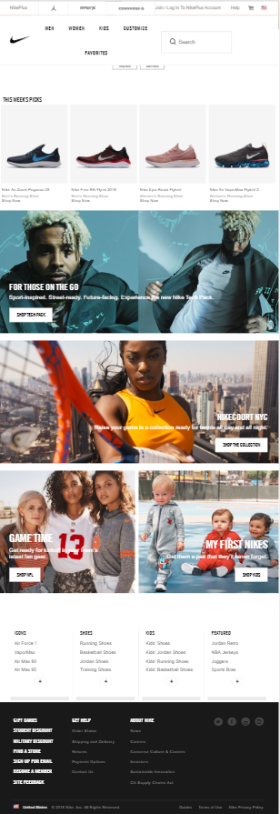

# _Nike Home Page Mockup_

#### _A responsive mockup of Nike's homepage_

#### By _**Hassan Al-khalifah**_

## Description

_This webpage is a responsive mockup of Nike's homepage, [https://www.nike.com/us/en_us/](https://www.nike.com/us/en_us/). The website was designed with sass, Flexbox and media queries, allowing a smooth transition from desktop view to mobile view. Note that Nike's home page did not have a responsive design for mobile, thus the mockup was based on standard mobile design approaches._

_Here are some screen shots of the website and mockup comparisons:_

**_Nike desktop header and body_**


**_Mockup desktop header and body_**


----

**_Nike desktop body and footer_**


**_Mockup desktop body and footer_**


----

**_Nike mid size body_**


**_Mockup mid size body_**


----

**_Nike tablet and phone header and body_**


**_Mockup tablet and phone header and body_**


----

**_Nike tablet and phone body and footer_**



**_Mockup tablet and phone body and footer_**


_You can view the website live [*here*](https://hassan-a-alkhalifah.github.io/nike-home-page-mockup/)_


## Setup/Installation Instructions

* _Make sure you have Git downloaded and setup on your local device._

* _Open terminal on your local device._

* _If you have not configured Git on your local device, in the terminal, you will need to set up a global configuration by entering the following:_

```
_git config --global user.name "Your first and last name"_

git config --global user.email example@gmail.com_
```
* _If you're not already in the desktop directory in your terminal, then direct yourself to the desktop directory by entering the follow in your terminal:_

`_cd Desktop_`

* _You can now begin by cloning the GitHub remote repository to your desktop. On the GitHub website with the remote GitHub repository, you will find a button colored green with the text "Clone or Download." Click the button and copy the GitHub repository URL._

* _Now in your terminal, enter the following:_

`_git clone "the GitHub repository URL you copied"_` without the quotes

* _Now your desktop should have a local copy of the cloned repository._

* _To view the webpage, in your terminal, enter the following:_

`_open index.html_`

* _The webpage should simply open in your default web browser._

## Technologies Used

* _Javascript_

* _jQuery_

* _HTML5_

* _CSS3_

* _SASS_

* _Git_

* _GitHub_

* _README_

### License

Copyright (c) 2018 **_Hassan Al-khalifah_**
